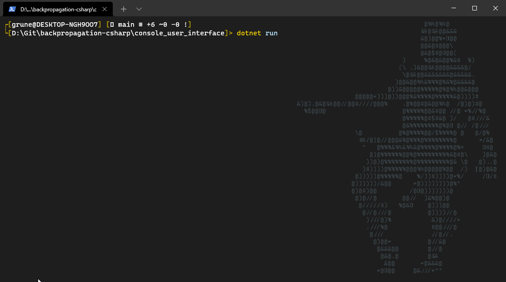

# Project
The goal was to implement a **backpropagation neural 
network** with **sigmoid function activation**, from scratch
(meaning, without using an external library, 
like `tensorflow` or `pytorch`) for an university project.

I have chosen C#, because I think it's pretty neat, and implemented
the network in an OOP way. So for example there's a class like 
`Layer` that holds a list of `Neuron`, which itself is an interface 
that the actual output or input neurons implement.

This is of course less efficient than raw arrays/matrices and 
other ways to write a neural network. But the goal was to implement 
a network - and not specifically a very performant one.

The console user interface is simple. There are commands to initialize
the network, set the learning rate, read (load) a dataset, train, 
and finally test the network.

# Media

# Usage
- `cd console_user_interface`
- `dotnet run`

and then commands like...
- `init 2 1 3 4` to initialize the network with 2 input neurons, 
  1 neuron in the output layer, 3 neurons in the first hidden layer,
  and 4 neurons in the second hidden layer,
  (not the order is `<input> <output> <hidden 1> <hidden 2> <hidden 3> <...>`)
- `read ../sets/xor.txt` to load the XOR dataset,
  which has 2 inputs and 1 output
- `train` to train the network on the loaded dataset
- (press `X` to stop training)
- `test` to test the network on the loaded dataset 
  (get output, but without the backpropagation step)

# Project Structure
- console - simple XOR showcase, without a nice interface
- console_user_interface - nice console user interface
- lib - the core functionalities, classes, etc, generally the network
- sets - datasets for training and testing

# Etc
License is MIT.
